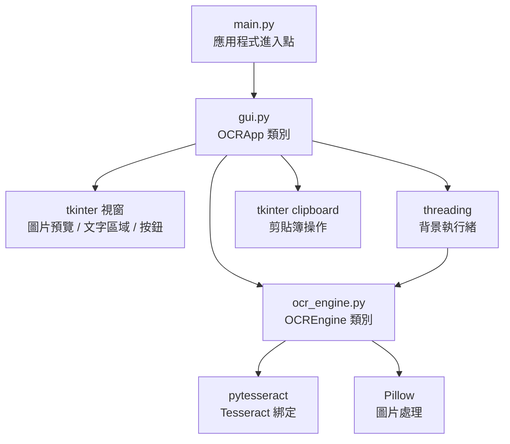
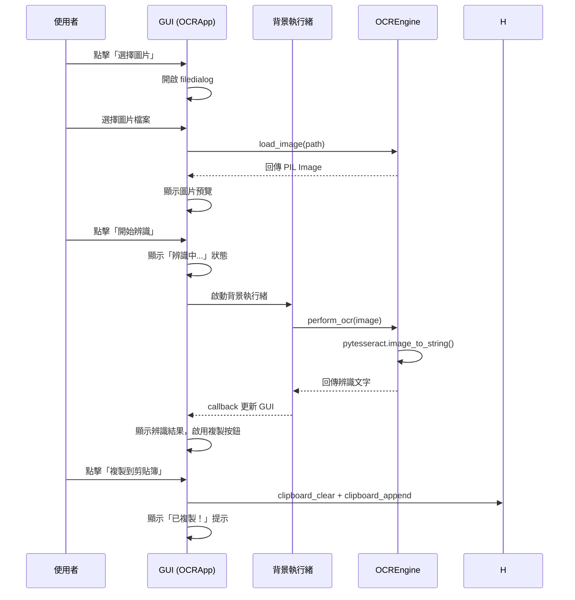

# Design Document

## Overview

OCR Python GUI 是一個基於 tkinter 的桌面應用程式，提供圖片載入、OCR 文字辨識與剪貼簿複製功能。採用 MVC-like 架構，將 GUI 展示層、OCR 處理邏輯與應用程式控制流程分離，確保可維護性與可測試性。

## Steering Document Alignment

### Technical Standards
- 使用 Python 標準庫 tkinter 作為 GUI 框架，無需額外安裝 GUI 套件
- 使用 pytesseract 作為 Tesseract OCR 的 Python 綁定
- 使用 Pillow (PIL) 處理圖片載入與縮放
- 使用 threading 模組實現非阻塞 OCR 處理

### Project Structure
```
ocr-python-gui/
├── main.py              # 應用程式進入點
├── ocr_engine.py        # OCR 處理邏輯
├── gui.py               # tkinter GUI 介面
├── requirements.txt     # Python 相依套件
├── README.md            # 專案說明與安裝指引
└── .gitignore           # Git 忽略規則
```

## Code Reuse Analysis

### Existing Components to Leverage
- **tkinter**：Python 內建 GUI 框架，無需額外安裝
- **tkinter.filedialog**：檔案選擇對話框
- **tkinter.messagebox**：錯誤與提示訊息

### Integration Points
- **Tesseract OCR**：透過 pytesseract 呼叫系統安裝的 Tesseract 引擎
- **System Clipboard**：透過 tkinter 內建的 clipboard 方法操作剪貼簿
- **PIL/Pillow**：圖片載入、格式驗證與縮放

## Architecture



### 使用者操作流程



## Components and Interfaces

### Component 1：OCREngine（ocr_engine.py）
- **Purpose：** 封裝所有 OCR 相關的處理邏輯，包含圖片載入、驗證與文字辨識
- **Interfaces：**
  ```python
  class OCREngine:
      SUPPORTED_FORMATS = ('.png', '.jpg', '.jpeg', '.bmp', '.tiff')

      def __init__(self) -> None:
          """初始化 OCR 引擎，檢查 Tesseract 是否可用"""

      def is_available(self) -> bool:
          """檢查 Tesseract 是否已安裝且可用"""

      def load_image(self, file_path: str) -> Image:
          """載入並驗證圖片檔案，回傳 PIL Image 物件
          Raises: ValueError（不支援的格式）, FileNotFoundError, IOError（檔案損壞）"""

      def perform_ocr(self, image: Image, lang: str = 'chi_tra+eng') -> str:
          """對圖片執行 OCR 辨識，回傳辨識出的文字
          Raises: RuntimeError（OCR 失敗）"""
  ```
- **Dependencies：** pytesseract, Pillow
- **Reuses：** 無（新建模組）

### Component 2：OCRApp（gui.py）
- **Purpose：** 建構 tkinter GUI 介面，處理使用者互動與流程控制
- **佈局策略：** 使用 `pack` 佈局搭配 `expand=True, fill=BOTH`，使視窗可調整大小且版面自適應
- **Interfaces：**
  ```python
  class OCRApp:
      def __init__(self, root: tk.Tk) -> None:
          """初始化 GUI 元件與 OCREngine
          - 設定視窗標題、最小尺寸
          - 建立所有 widget（按鈕、圖片預覽 Label、Text + Scrollbar、狀態列）
          - 使用 pack 佈局，圖片預覽與文字區域設定 expand=True, fill=BOTH
          - 檢查 OCREngine.is_available()，若不可用則在狀態列顯示警告"""

      def select_image(self) -> None:
          """開啟檔案選擇對話框，載入並預覽圖片
          - filedialog.askopenfilename 設定 filetypes 過濾器：
            [("圖片檔案", "*.png *.jpg *.jpeg *.bmp *.tiff"), ("所有檔案", "*.*")]
          - 呼叫 OCREngine.load_image() 載入圖片
          - 呼叫 _resize_preview_image() 縮放後顯示預覽"""

      def _resize_preview_image(self, image: Image, max_width: int, max_height: int) -> ImageTk.PhotoImage:
          """將圖片縮放至預覽區域大小，保持原始比例
          - 使用 Image.thumbnail((max_width, max_height), Image.LANCZOS)
          - 轉換為 ImageTk.PhotoImage 供 tkinter Label 顯示
          - 注意：OCR 辨識使用原始圖片，此方法僅用於預覽顯示"""

      def start_ocr(self) -> None:
          """啟動背景執行緒執行 OCR 辨識
          - 先檢查 OCREngine.is_available()，若不可用則彈出安裝說明對話框
          - 設定 is_processing = True
          - 停用「選擇圖片」和「開始辨識」按鈕，防止重複操作
          - 顯示「辨識中...」狀態
          - 啟動 threading.Thread(target=_run_ocr_thread)"""

      def _run_ocr_thread(self) -> None:
          """背景執行緒中執行 OCR
          - 呼叫 OCREngine.perform_ocr(self.current_image)
          - 使用 self.root.after(0, self._on_ocr_complete, result) 回到主執行緒更新 GUI
          - 不直接操作任何 tkinter widget（tkinter 非執行緒安全）"""

      def _on_ocr_complete(self, result: str) -> None:
          """OCR 完成後在主執行緒中更新 GUI
          - 將辨識結果顯示在 Text widget 中
          - 若結果非空：啟用「複製到剪貼簿」按鈕
          - 若結果為空：顯示「未偵測到文字」
          - 重新啟用「選擇圖片」和「開始辨識」按鈕
          - 設定 is_processing = False"""

      def copy_to_clipboard(self) -> None:
          """將文字區域內容複製到系統剪貼簿
          - root.clipboard_clear() + root.clipboard_append(text)
          - 顯示「已複製！」成功提示"""

      def _update_status(self, message: str) -> None:
          """更新狀態列 Label 的文字"""
  ```
- **Dependencies：** tkinter, OCREngine, threading
- **Reuses：** tkinter 內建的 filedialog、messagebox、clipboard 方法；Pillow 的 ImageTk

### Component 3：main.py（應用程式進入點）
- **Purpose：** 建立 tkinter 主視窗，啟動應用程式
- **Interfaces：**
  ```python
  def main() -> None:
      """建立 Tk root 視窗，實例化 OCRApp，進入主迴圈"""
  ```
- **Dependencies：** tkinter, gui.OCRApp

## Data Models

### GUI 佈局結構
```
+------------------------------------------+
|           OCR 文字辨識工具                  |
+------------------------------------------+
|  [選擇圖片]  [開始辨識]                     |
+------------------------------------------+
|                                          |
|          圖片預覽區域                       |
|        (tkinter Label                    |
|         + PhotoImage)                    |
|                                          |
+------------------------------------------+
|  辨識結果：                                |
|  +--------------------------------------+|
|  |                                      ||
|  |     文字顯示區域                       ||
|  |   (tkinter Text widget,             ||
|  |    可捲動, 可選取)                     ||
|  |                                      ||
|  +--------------------------------------+|
+------------------------------------------+
|  [複製到剪貼簿]          狀態列：就緒        |
+------------------------------------------+
```

### 狀態管理
```
應用程式狀態（以 OCRApp 實例變數表示）：
- current_image: Optional[PIL.Image]  # 當前載入的原始圖片（OCR 使用原始解析度）
- preview_photo: Optional[ImageTk.PhotoImage]  # 縮放後的預覽圖片（避免被 GC 回收）
- ocr_result: str                     # OCR 辨識結果文字
- is_processing: bool                 # 是否正在執行 OCR（控制按鈕停用/啟用）
```

### 大圖片處理策略
- 預覽顯示：使用 `Image.thumbnail()` 縮放至預覽區域大小，僅用於顯示
- OCR 辨識：使用原始解析度圖片，確保辨識準確度
- 記憶體管理：同一時間只保留一張原始圖片與一張預覽圖片，載入新圖片時釋放前一張

## Error Handling

### Error Scenarios
1. **Tesseract 未安裝**
   - **Handling：** OCREngine.__init__() 中檢測，設定 is_available = False
   - **User Impact：** 啟動時在狀態列顯示警告訊息，點擊辨識時彈出對話框顯示安裝說明與連結（Windows: https://github.com/UB-Mannheim/tesseract/wiki ）

2. **不支援的圖片格式**
   - **Handling：** filedialog 設定過濾器限制可選格式；OCREngine.load_image() 二次驗證
   - **User Impact：** 顯示 messagebox 錯誤提示「不支援的檔案格式」

3. **圖片檔案損壞或無法讀取**
   - **Handling：** Pillow Image.open() 的例外被 OCREngine.load_image() 捕獲
   - **User Impact：** 顯示 messagebox 錯誤提示「無法載入圖片」

4. **OCR 辨識失敗**
   - **Handling：** pytesseract 例外被 perform_ocr() 捕獲
   - **User Impact：** 文字區域顯示錯誤訊息，狀態列更新為「辨識失敗」

5. **OCR 結果為空**
   - **Handling：** perform_ocr() 回傳空字串時特別處理
   - **User Impact：** 文字區域顯示「未偵測到文字」，複製按鈕維持停用

## Testing Strategy

### Unit Testing
- 測試 OCREngine.load_image() 對各種圖片格式的載入行為（REQ-001 AC-2）
- 測試 OCREngine.load_image() 對不支援格式的錯誤處理（REQ-001 AC-3）
- 測試 OCREngine.load_image() 對損壞檔案的錯誤處理（Reliability NFR）
- 測試 OCREngine.perform_ocr() 的文字辨識結果（REQ-002 AC-3）
- 測試 OCREngine.is_available() 的 Tesseract 檢測邏輯（Reliability NFR）

### Integration Testing
- 測試完整流程：載入圖片 → OCR 辨識 → 取得結果（REQ-001 + REQ-002）
- 測試背景執行緒的 OCR 處理與 root.after() 回調機制（REQ-002 AC-2）

### End-to-End Testing
- 手動測試：選擇圖片 → 點擊辨識 → 確認文字 → 複製到剪貼簿 → 在其他應用貼上驗證（REQ-001 ~ REQ-003）
- 測試不同大小、解析度的圖片（Reliability NFR）
- 測試繁體中文與英文混合的圖片（REQ-002 AC-5）
